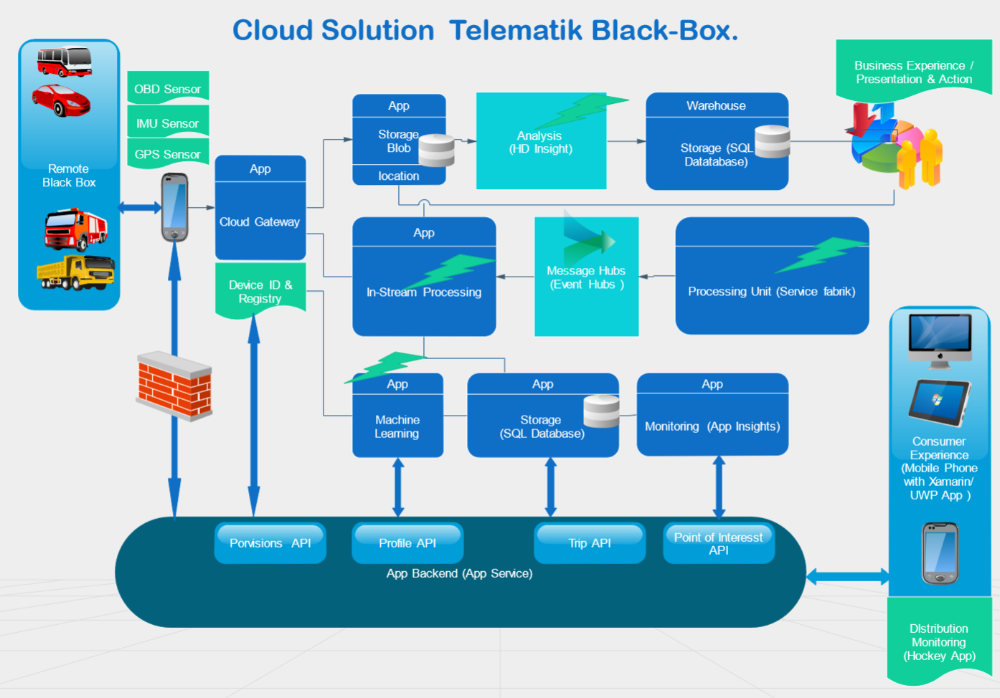
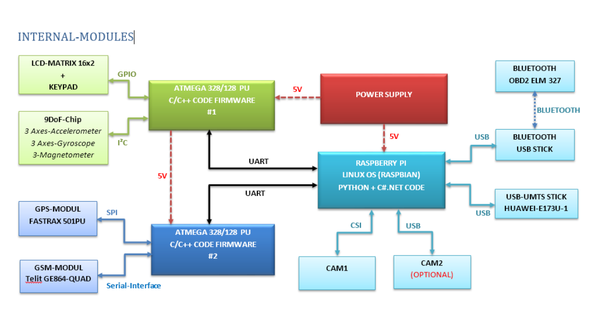
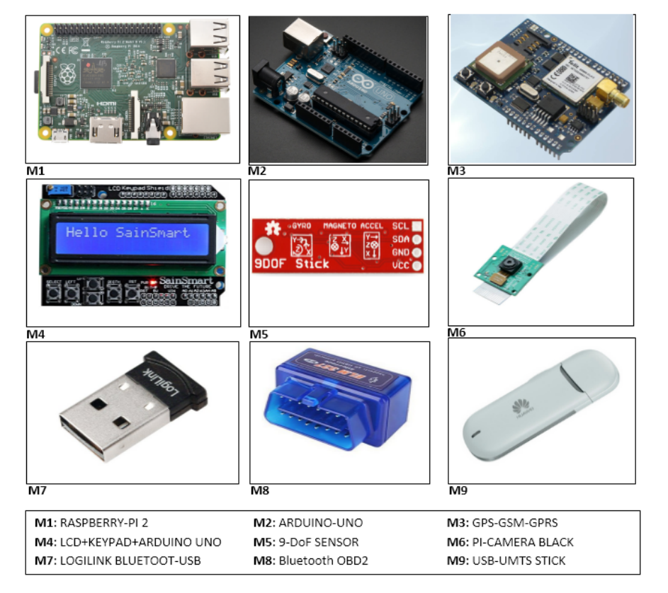
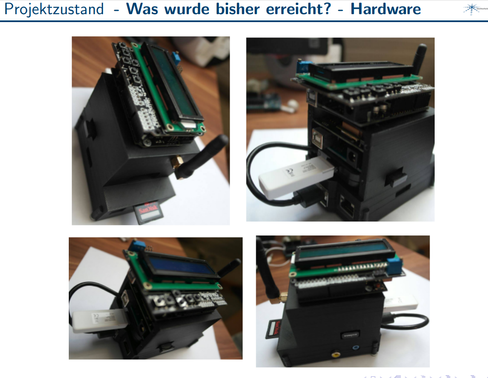
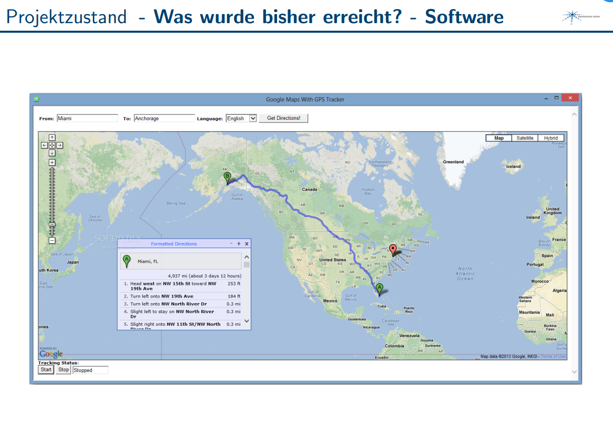

# Cloud Telematik_Black_Box

Die Blackbox im Auto ist einer der wichtigsten Punkte der Telematik.
Ziel dieses Projekts ist es ein elektronishes Gerät zu entwickeln, dass uns ermöglicht unterschiedliche Sensordaten eines Fahrzeugs 
zu erfassen, und diese auf einen Remote Webserver zu übertragen. 

Dieses kleine Gerät wird im Fahrzeug eingebaut und ist in der Lage, nützliche Informationen über Fahrzeug und Fahrer zu sammeln und erlaubt es, eine große Menge an Daten zu erheben. 
Von Standortdaten zur GPS-Ortung, bis hin zu möglichen Fehlercodes im internen Fahrzeug-Netzwerk.

## Wie funktioniert die GPS-Blackbox (Fahrzeug-Telematiken)?

Die Blackbox hat zwei Hauptfunktionen: das Sammeln von Daten und die Übertragung dieser. Um Daten zu sammeln, kann das Gerät an verschiedene Quellen wie CAN-Bus, OBD-Anschluss oder native Sensoren wie Zündung, Tankanzeige, Türsensoren usw. angeschlossen werden. Interne Algorithmen in der Blackbox werten alle Daten aus und es werden vorformatierte Informationen erstellt. Anschließend werden alle Daten in Echtzeit mit der internen SIM-Karte, die ein normales mobiles Netz verwendet, übertragen. Auf einer externen Plattform (in unserem Fall die Azure-Cloud-Plattform) werden alle Daten gesammelt und für den Endbenutzer zugänglich gemacht, wo verschiedene Berichte und Analysen zur Verfügung stehen.

Falls, aus welchem Grund auch immer, kein mobiles Netzwerk verfügbar ist, fungiert die Blackbox wie ein digitaler Fahrdatenschreiber und speichert alle Daten im internen Speicher. Sobald ein Netzwerk wieder verfügbar ist, werden die Daten übermittelt.

# Hardware Architektur

# Welche Daten können von der Blackbox erhoben werden?

Hier eine Liste der daten die die Telematik Black Box verarbeiten kann : 

* GPS-Ort
* Geschwindigkeit
* Kilometeranzahl
* Aufnahmen von Fahrten
* Zeit vor Ort
* Kraftstoffverbrauch
* Hartes Fahrerverhalten mit IMU (Inertial Measurment Unit)
* Fehler und Fehlercodes
* Verwendung des Tempomats
* Verwendung von Sicherheitsgurten
- Motorlast
- Motortemperatur

# Hardware Komponenten

# Projektzustand - Was wurde bisher erreicht? - Hardware

# Projektzustand - Was wurde bisher erreicht? - Software

# besondere Schwierigkeiten
- Entscheidung fur geeignete und g ¨ ungstige Hardware Komponenten 
- Enstscheidung der Technologie und Programmiersprache fur die Clientanwendungen
- Airbag-Zustand auslesen uber das OBD2-Diagnose Gerät, da Sicherheitsrelevant und sehr herstellerabhängig

# Wie geht es weiter ?
  * Integration weiterer Sensoren z.B.: Kamera, Accelerometer, Gyroscope usw. . .
  * Entwickung nutzliche Clientfunktionalit¨aten z.B.: Fernsteuerung, Visualisierung
  * Durchfuhrung von Tests
  * bessere Integration in Azure Cloud Umgebung (Update einige Cloud-Funktion mit der neue .net Core Framework)
